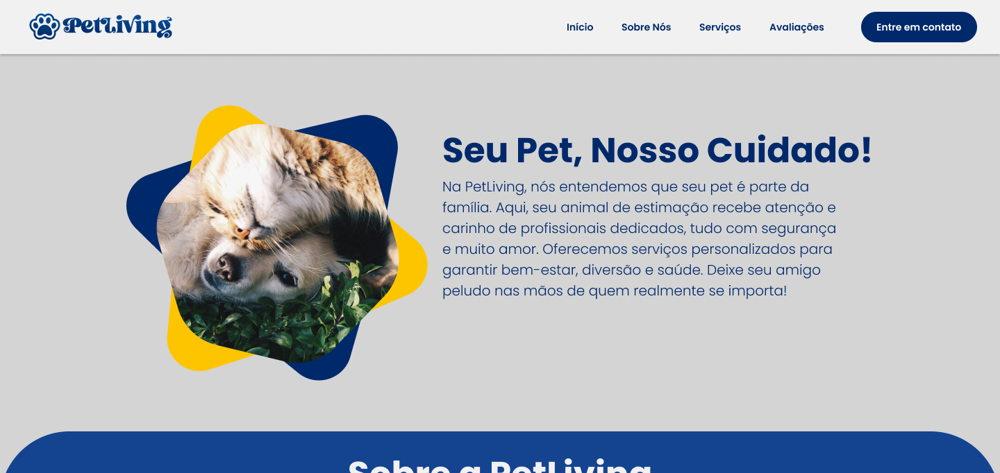

<div align="center"> 

</div>

# PetLiving 🐶

**PetLiving** é uma página para um petshop focada em divulgar seus serviços e apresentar informações sobre a empresa. O projeto foi desenvolvido utilizando **ReactJS** e oferece uma interface simples e eficiente para os usuários acessarem as informações sobre os serviços do petshop e muito mais. É um projeto criado para aprimorar o meu conhecimento com o intuito de me familiarizar ainda mais com o framework.

## Funcionalidades

- **Sobre Nós**: Informações sobre a empresa, missão, visão e valores.
- **Avaliações de Usuários**: Depoimentos e feedbacks de clientes que utilizaram os serviços do petshop.
- **Serviços Oferecidos**: Listagem dos principais serviços que o petshop oferece, com descrição de cada um.
- **Fale Conosco**: Formulário de contato para que os usuários possam entrar em contato com a empresa diretamente.

## Demonstração

Acesse o projeto hospedado para uma demonstração:

[PetLiving - Demo](https://pet-living.vercel.app/)

## Tecnologias Utilizadas

- **ReactJS**: Biblioteca JavaScript para construção da interface do usuário.
- **CSS**: Para o design e estilo da página.
- **Vercel**: Plataforma de hospedagem para o deploy do projeto.
- **Figma**: Para a prototipação do design do projeto.
Além de alguns recursos extras...

## Como Rodar o Projeto Localmente

1. Clone o repositório:
   ```bash
   git clone https://github.com/portelagu/PetLiving.git

2. Navegue até o diretório do projeto:
   ```bash
   cd PetLiving

3. Instale as dependências:
   ```bash
   npm install

4. Instale as dependências:
   ```bash
   npm start

Agora, você pode acessar o site localmente em http://localhost:3000.